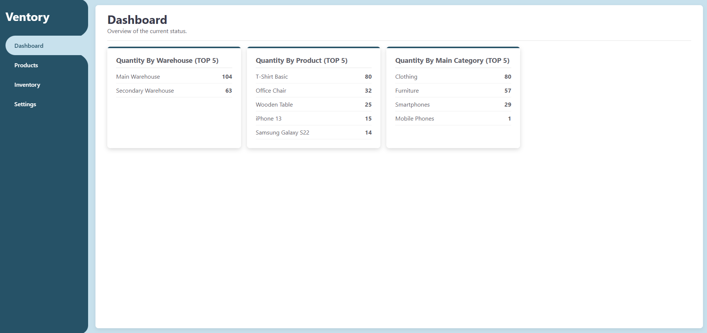
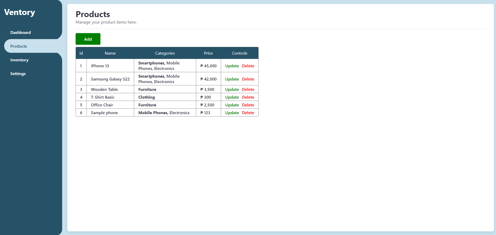
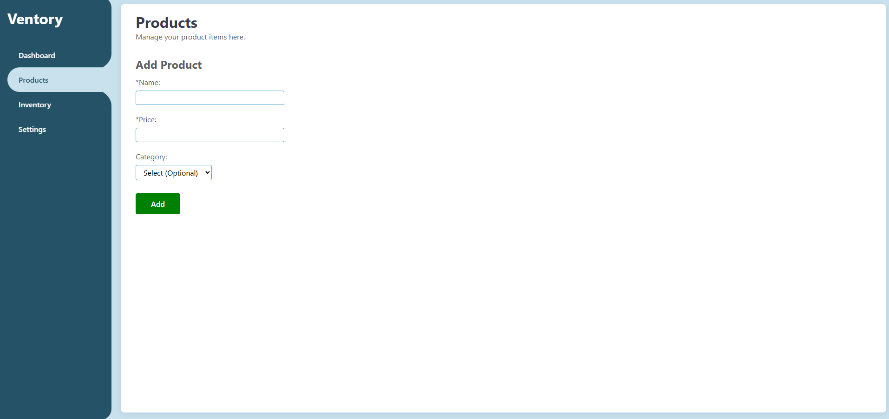
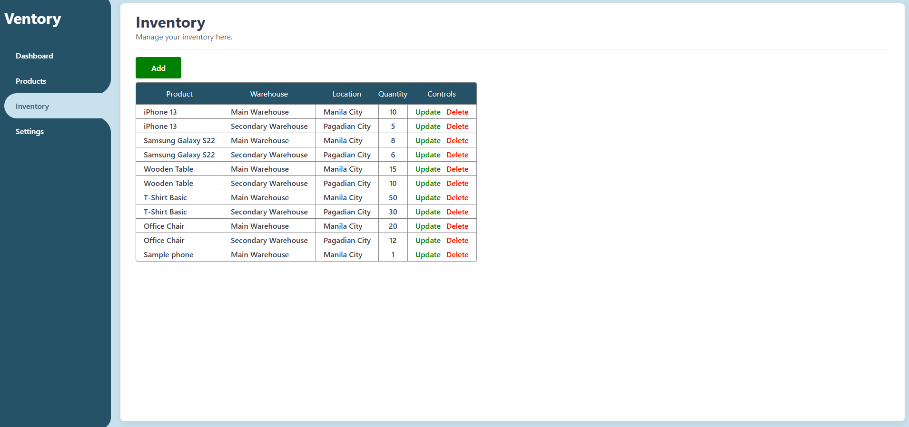
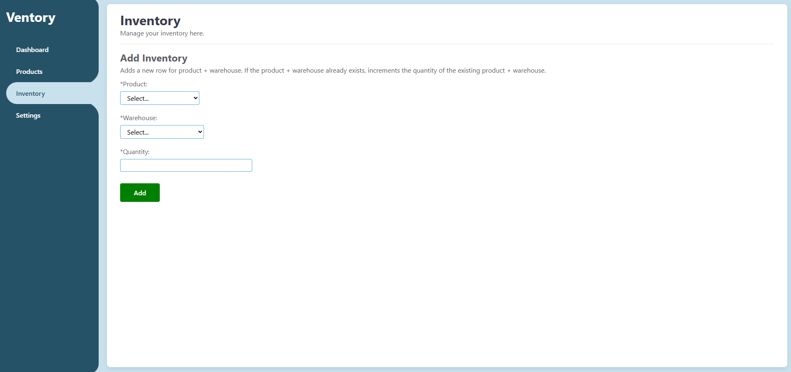
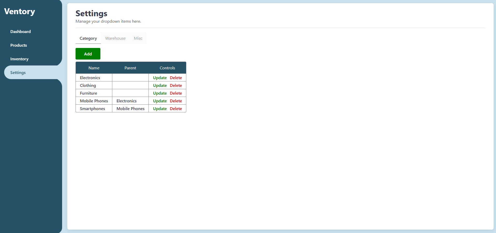
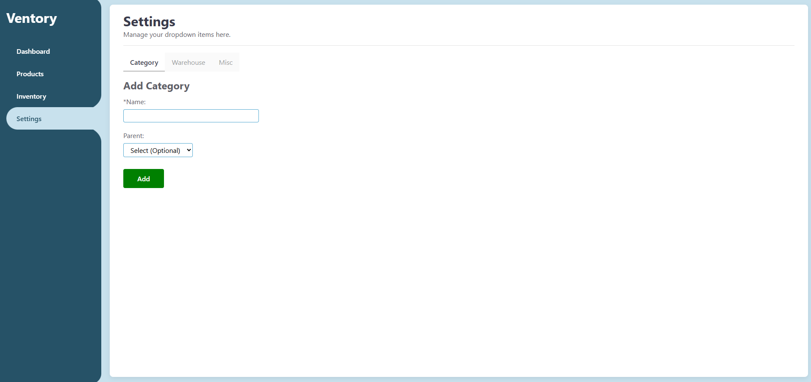
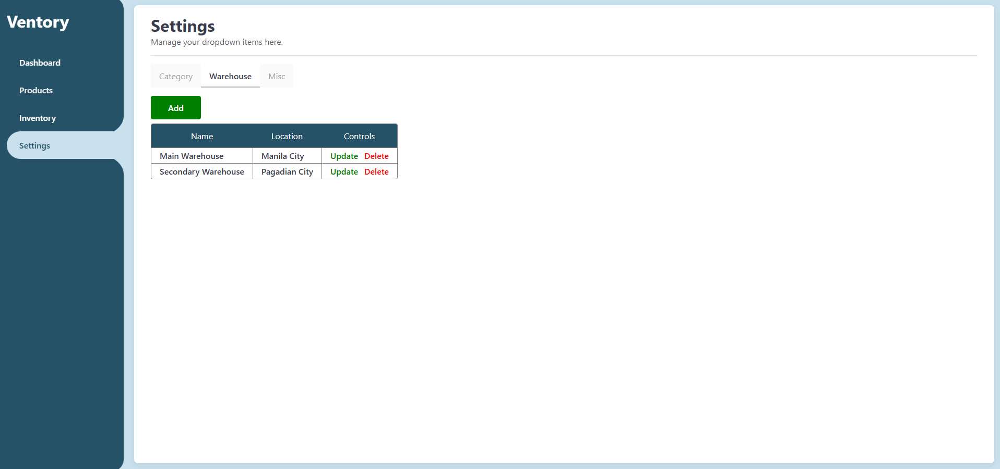
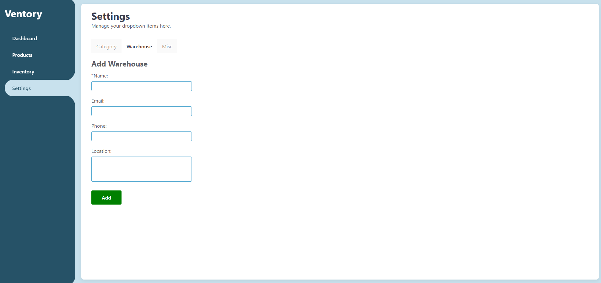
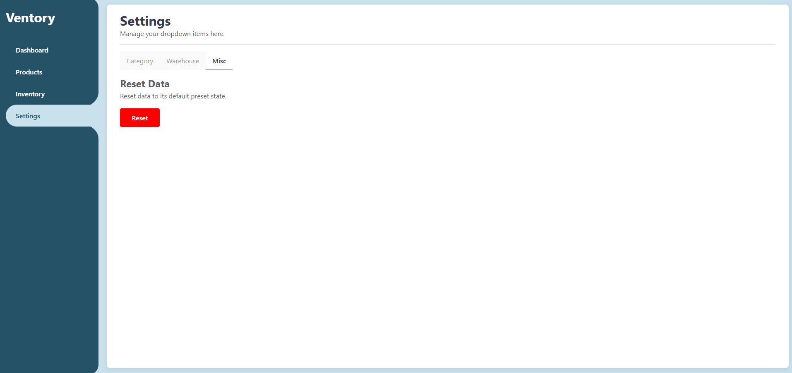

# Ventory

**A Simple Inventory Management Application**

A full-stack web app for tracking products, categories, inventory levels across warehouses, and more. Built as the final project for **The Odin Project's Node.js Course** (Express + PostgreSQL section).

## ✨ Features

- **Dashboard** – Overview of current stock with Top 5 lists:
  - Quantity by Warehouse
  - Quantity by Product
  - Quantity by Main Category
- **Products Management** – Add, update, delete products with name, hierarchical categories, and price
- **Inventory Management** – Track stock quantities per product in each warehouse
- **Settings** – Manage dropdown data:
  - Hierarchical **Categories** (e.g., Electronics → Mobile Phones → Smartphones)
  - **Warehouses** with locations
  - **Misc** – One-click “Reset Data” to default preset state
- Responsive, clean UI with update/delete controls on every row
- Full CRUD operations with PostgreSQL backend

## 📸 Screenshots

**Dashboard**  

**Products Page**  

**Inventory Page**  

**Settings – Categories**  

**Settings – Warehouses**  

**Settings – Misc / Reset Data**  

## 🛠️ Technologies & Skills Applied

This project was built while completing **The Odin Project – NodeJS Course**

### Topics Covered & Applied:

- **Node.js Fundamentals**
  - Introduction to the Back End
  - What is Node.js?
  - Getting Started, Debugging Node, Environment Variables
  - Project: Basic Informational Site

- **Express.js**
  - Introduction to Frameworks & Express
  - Routes & Controllers
  - Views (EJS templating)
  - Forms and Data Handling
  - Project: Mini Message Board (intermediate step)
  - Project: **Inventory Application** ← **This app**

- **Database**
  - Installing & Using PostgreSQL
  - Relational database design
  - Complex joins (products ↔ categories ↔ inventory ↔ warehouses)

- **Deployment-ready structure** (ready for Render, Railway, etc.)
